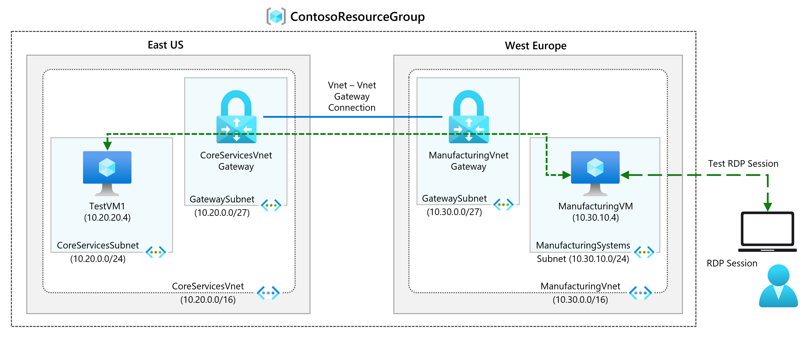
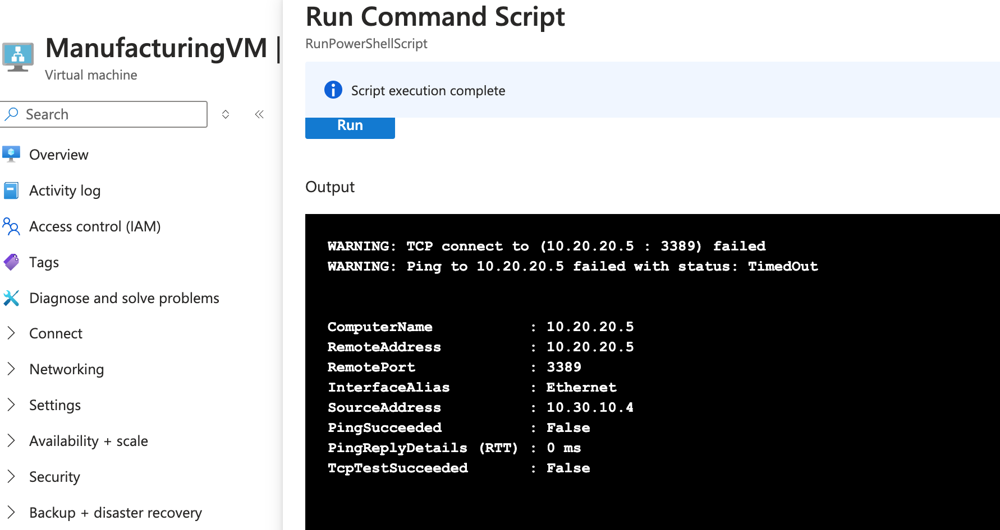
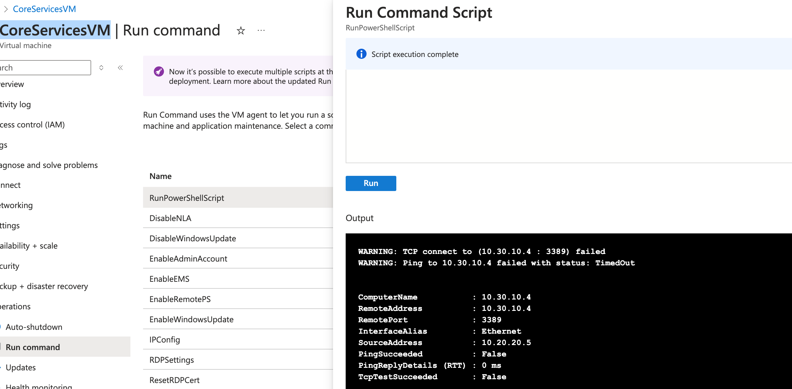
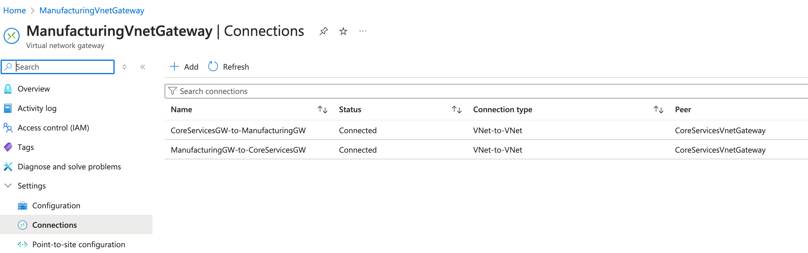
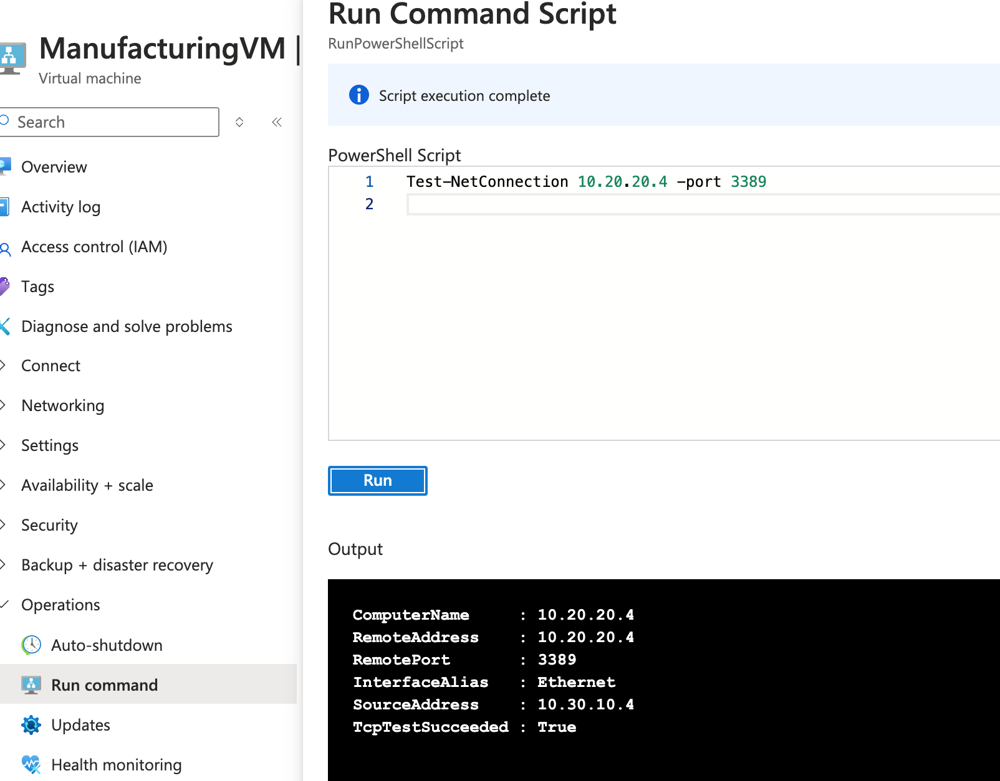

# Create and configure a virtual network gateway

Will configure a virtual network gateway to connect the Contoso Core Services VNet and Manufacturing VNet.

In this exercise, we will create:

- Task 1: Create CoreServicesVnet and ManufacturingVnet
- Task 2: Create CoreServicesVM
- Task 3: Create ManufacturingVM
- Task 4: Connect to the VMs using RDP
- Task 5: Test the connection between the VMs
- Task 6: Create CoreServicesVnet Gateway
- Task 7: Create ManufacturingVnet Gateway
- Task 8: Connect CoreServicesVnet to ManufacturingVnet
- Task 9: Connect ManufacturingVnet to CoreServicesVnet
- Task 10: Verify that the connections connect
- Task 11: Test the connection between the VMs

# Task 5 : Output

Verification output that VMs in created in 2 different subnets are not able to communicate.

 

# Task 10 : Output

Once the connection between CoreServicesVnet and ManufacturingVnet is established, which is shown as

Connection is successful

