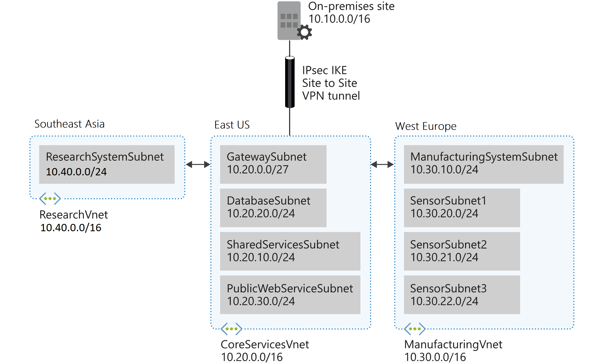
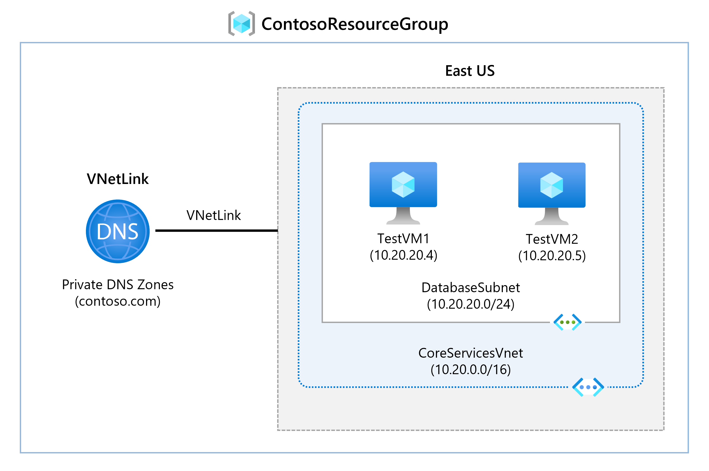
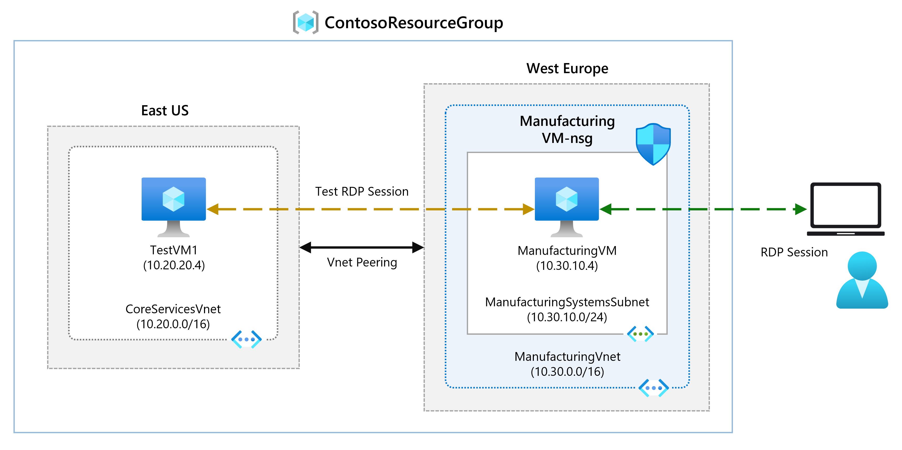

# Design and implement a Virtual Network in Azure

## Exercise scenario

Deploy virtual networks in the Azure portal.

Consider the fictional organization Contoso Ltd, which is in the process of migrating infrastructure and applications to Azure. In your role as network engineer, you must plan and implement three virtual networks and subnets to support resources in those virtual networks.

1. The **CoreServicesVnet** virtual network is deployed in the **East US region**. This virtual network will have the largest number of resources. It will have connectivity to on-premises networks through a VPN connection. This network will have web services, databases, and other systems that are key to the operations of the business. Shared services, such as domain controllers and DNS also will be located here. A large amount of growth is anticipated, so a large address space is necessary for this virtual network.

2. The **ManufacturingVnet** virtual network is deployed in the **West Europe region**, near the location of your organization's manufacturing facilities. This virtual network will contain systems for the operations of the manufacturing facilities. The organization is anticipating a large number of internal connected devices for their systems to retrieve data from, such as temperature, and will need an IP address space that it can expand into.

3. The **ResearchVnet** virtual network is deployed in the **Southeast Asia region**, near the location of the organization's research and development team. The research and development team uses this virtual network. The team has a small, stable set of resources that is not expected to grow. The team needs a small number of IP addresses for a few virtual machines for their work.

## Virtual Network and Subnet Details

| **Virtual Network**   | **Region**     | **Virtual Network Address Space** | **Subnet**                | **Subnet Address Space** |
| --------------------- | -------------- | --------------------------------- | ------------------------- | ------------------------ |
| **CoreServicesVnet**  | East US        | 10.20.0.0/16                      | GatewaySubnet             | 10.20.0.0/27             |
|                       |                |                                   | SharedServicesSubnet      | 10.20.10.0/24            |
|                       |                |                                   | DatabaseSubnet            | 10.20.20.0/24            |
|                       |                |                                   | PublicWebServiceSubnet    | 10.20.30.0/24            |
| **ManufacturingVnet** | West Europe    | 10.30.0.0/16                      | ManufacturingSystemSubnet | 10.30.10.0/24            |
|                       |                |                                   | SensorSubnet1             | 10.30.20.0/24            |
|                       |                |                                   | SensorSubnet2             | 10.30.21.0/24            |
|                       |                |                                   | SensorSubnet3             | 10.30.22.0/24            |
| **ResearchVnet**      | Southeast Asia | 10.40.0.0/16                      | ResearchSystemSubnet      | 10.40.0.0/24             |

# Configure DNS settings in Azure

Configure DNS name resolution for Contoso Ltd. You will create a private DNS zone named contoso.com, link the VNets for registration and resolution, and then create two virtual machines and test the configuration.

# Connect two Azure Virtual Networks using global virtual network peering

In this unit, you will configure connectivity between the CoreServicesVnet and the ManufacturingVnet by adding peerings to allow traffic flow.

