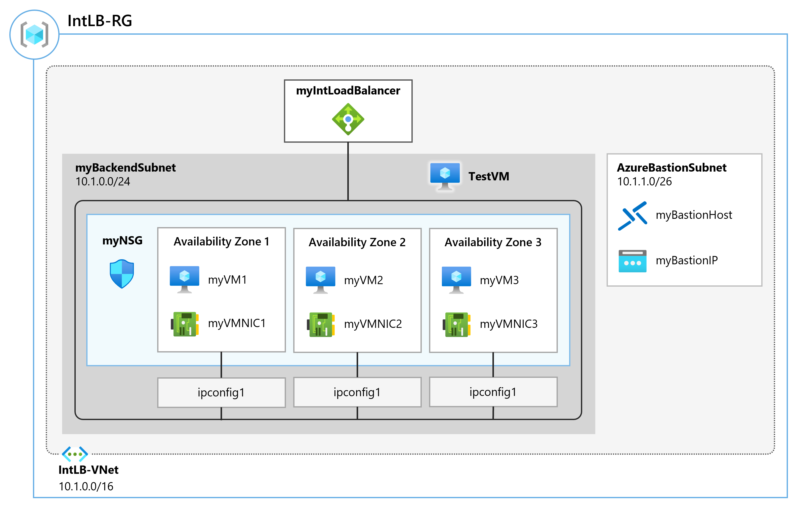

# Create and configure an Azure load balancer

Create an internal load balancer for the fictional Contoso Ltd organization.

The steps to create an internal load balancer, are very similar to those you have already learned about in this module, to create a public load balancer. The key difference is that with a public load balancer the front end is accessed via a public IP address, and you test connectivity from a host which is located outside your virtual network; whereas, with an internal load balancer, the front end is a private IP address inside your virtual network, and you test connectivity from a host inside the same network.

## Tasks are:

- Task 1: Create the virtual network
- Task 2: Create backend servers
- Task 3: Create the load balancer
- Task 4: Create load balancer resources
- Task 5: Test the load balancer

# Key Components for Azure Load Balancer:

- Azure Load Balancer: The main load balancer resource itself.
- Backend Pool: A collection of virtual machines or network interfaces that the load balancer will distribute traffic to.
- Frontend IP Configuration: A public or private IP address associated with the load balancer to receive incoming traffic.
- Health Probes: These determine the health of the instances in the backend pool and help the load balancer decide where to route traffic.
- Load Balancer Rules: Define how incoming traffic is distributed to the backend pool.
- Network Security Group (NSG): A security rule to allow or block traffic to the backend VMs.
- NIC (Network Interface): A network interface attached to VMs for communication with the backend pool.
- Public IP (optional): Used if you want the load balancer to have a public IP for incoming traffic from the internet.
